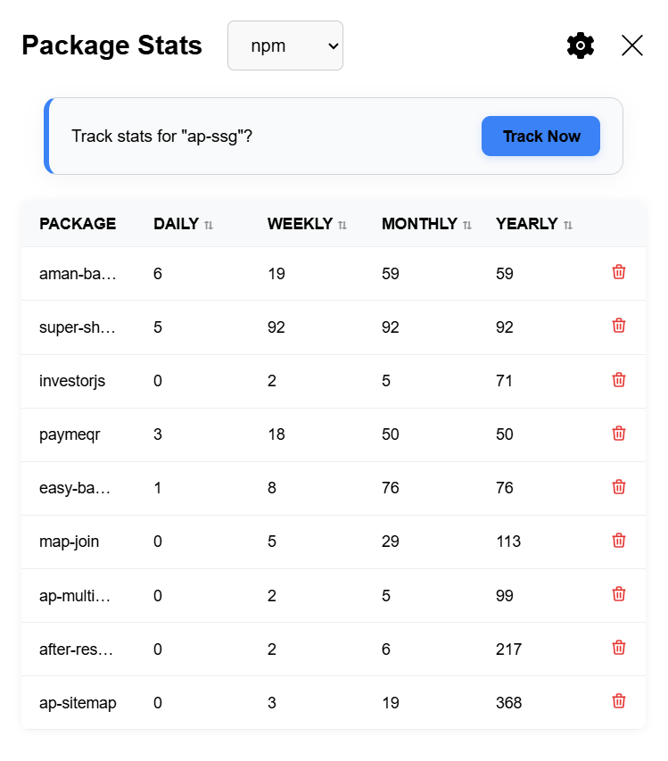

# pkg-stats

pkg-stats is a Chrome extension that provides real-time download statistics for npm packages directly within any webpage. Track your favorite packages and view detailed stats in a streamlined sidebar interface.

---

## Features

- One-click tracking: Add npm packages to your tracked list directly from their pages
- Detailed stats: View daily, weekly, monthly, and yearly download data from both `npm` and `jsDelivr`
- Local storage: Tracked data is stored in your browser via Chrome Storage
- Import/Export: Easily import or export your tracked list with .txt files (via the settings page)
- Clear all: Instantly remove all tracked packages from settings
- Responsive UI: Fast updates and a smooth user experience

---

## Installation

1. Clone or download this repository
2. Open Chrome and go to `chrome://extensions/`
3. Enable Developer Mode (top right corner)
4. Click "Load unpacked" and select the root folder of this extension

---

## Screenshots

---

## Author

Developed by [Aman Pareek](https://amanpareek.in)

## License

MIT License — free to use, modify, and distribute.

---

For contributions, feature requests, or issues, please open an issue or submit a pull request.
